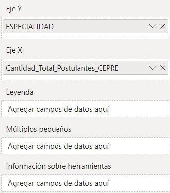
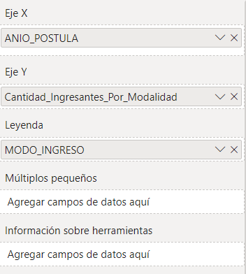
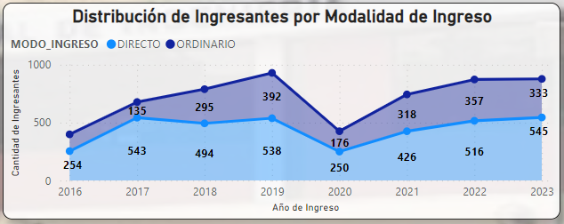
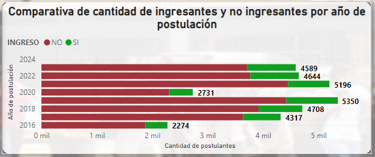
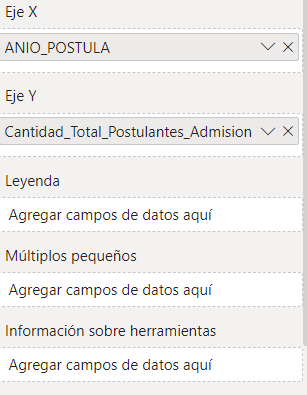
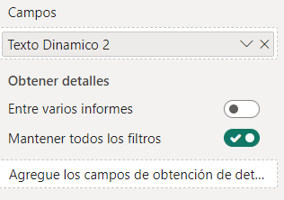
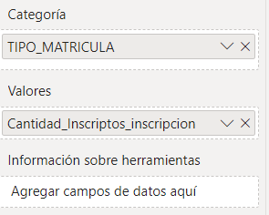

# Reporte de Análisis de Postulantes y Matriculados en la UNI

Este reporte lo desarrollé en Power BI y analicé tres datasets que forman parte del proceso de admisión a la Universidad Nacional de Ingeniería (UNI). Los datasets contienen información sobre:

1. **Postulantes a través de CEPRE-UNI**: Estudiantes que postulan mediante el Centro Preuniversitario de la UNI.
2. **Postulantes en el Examen de Admisión**: Aquellos que participan en el examen de admisión general.
3. **Matriculados en la UNI**: Estudiantes que se matricularon tras ser admitidos.

Los datasets los extraje de la página de datos abiertos **expresate Perú con datos**, dejo los enlaces específicos de los datasets:

- **Postulantes a través de CEPRE-UNI**: https://expresateperu.datosabiertos.gob.pe/dataset/alumnos-del-centro-pre-universitario-de-la-universidad-nacional-de-ingenier%C3%ADa-uni

- **Postulantes en el Examen de Admisión**: https://expresateperu.datosabiertos.gob.pe/dataset/postulantes-al-concurso-de-admisi%C3%B3n-de-la-universidad-nacional-de-ingenier%C3%ADa-uni/resource-1

- **Matriculados en la UNI**: https://expresateperu.datosabiertos.gob.pe/dataset/alumnos-matriculados-en-la-universidad-nacional-de-ingenier%C3%ADa-uni/resource/a7d798e2-dae5

El análisis permite visualizar el perfil de los postulantes, su rendimiento en los diferentes procesos, y las tasas de matriculación.

Antes de explicar las páginas del reporte, Explicaré el esquema que hicé para modelar los datos al incorporar los 3 datasets en el modelo de datos:

- Para este esquema utilicé los 3 datasets, primero los normalicé y realicé el proceso de ETL, también escogí campos y tablas que me podrían servir para realizar un reporte, el esquema completo es el siguiente:


- **Tabla estudiante**: La tabla **Estudiante** se encuentra en el centro del esquema de datos y almacena información clave sobre los estudiantes. Cada registro en esta tabla representa un estudiante único, y actúa como el punto central en las relaciones con otras tablas del esquema.

#### Relación:
- La tabla **Estudiante** tiene una relación de **uno a muchos** con las otras tablas, donde un estudiante puede estar asociado con múltiples registros en tablas relacionadas como **Inscripcion**, **Cepre**, y **Admision**, entre otras. Esto asegura que cada estudiante tenga un único identificador, pero puede aparecer varias veces en las tablas vinculadas según su participación en diferentes procesos.

<div align="center">
  
</div>

- **Tabla Domicilio**: La tabla **Domicilio** contiene los datos del lugar en el que viven los estudiantes.

<div align="center">
  
</div>

- **Tabla Lugar_Nacimiento**: La tabla **Lugar_Nacimiento** contiene los datos del lugar en el que nacierón los estudiantes.

<div align="center">
  
</div>

- **Tabla Colegio**: La tabla **Colegio** contiene los datos de los colegios en los que estudiarón los estudiantes.

<div align="center">
  
</div>

- **Tabla Cepre**: La tabla **Cepre** contiene los datos de los postulantes en el Centro Preuniversitario de la UNI de los estudiantes.

<div align="center">
  
</div>

- **Tabla Inscripcion**: La tabla **Inscripcion** contiene los datos de los registros en la UNI de los estudiantes de que se encuentrán en la UNI.

<div align="center">
  
</div>

- **Tabla Admision**: La tabla **Admision** contiene los datos de los postulantes en el la UNI de los estudiantes de que se encuentrán en la UNI.

<div align="center">
  
</div>

Después de explicar el esquema del modelo de datos continuaré con el reporte como tal, el reporte contiene 4 páginas:
1. **Presentación**: En está página aclaro unos detalles iniciales como **El objetivo**, **¿Qué acciones se tomarán con el reporte?**, **¿A qué público está dirigido?**, **Métricas utilicadas** y **Descripción:**.

2. **CEPRE-UNI**: En está página hago un reporte individual para los postulantes a la UNI mediante el Centro Preuniversitario de la UNI.

3. **Admision**: En está página hago un reporte individual para los postulantes a la UNI mediante el examen de admisión general.

4. **Matriculados**: En está página hago un reporte individual para los matrículados en la UNI.

## Página 1: Presentación
En está página realizo una introducción del reporte, presentando el **Objetivo**, **Descripción**, **Medidas** y respondo las preguntas **¿Qué acciones se tomarán con el reporte?**, **¿A qué público está dirigido?**.

<div align="center">
  
</div>

## Página 2: CEPRE-UNI
En está página realicé el reporte para los postulantes en CEPRE-UNI, en el cual realicé algunos gráficos y métricas.

<div align="center">
  
</div>

### Gráfico **Cantidad de postulantes por especialidad**:
Es un gráfico de barras agrupadas que me muestra la cantidad de postulantes por especialidad considerando todos los años, para ello en el Eje Y coloque el campo **ESPECIALIDAD** de la tabla **Cepre** y en el eje X la métrica **Cantidad_Total_Postulantes_CEPRE** la cual se cálcula con la siguiente función DAX:

```DAX
Cantidad_Total_Postulantes_CEPRE = COUNTROWS('Cepre')
```

Coloco lo que mencioné en las casillas adecuadas:

<div align="center">
  
</div>

Con lo que obtengo el gráfico de la siguiente manera:

<div align="center">
  
</div>

### Gráfico **Distribución de Ingresantes por Modalidad de Ingreso**:
Es un gráfico de áreas apiladas que me muestra la distribución de la cantidad de postulantes por las modalidades de ingreso, siendo estos "DIRECTO" o "ORDINARIO" y lo muestro desde el año 2016 al 2023, para ello en el Eje Y coloque el campo **ANIO_POSTULA** de la tabla **Cepre**, en leyenda coloque el campo **MODO_INGRESO** de la tabla **Cepre** y en el eje X la métrica **Cantidad_Ingresantes_Por_Modalidad** la cual se cálcula con la siguiente función DAX:

```DAX
Cantidad_Ingresantes_Por_Modalidad = CALCULATE(
    COUNT('CEPRE'[IDHASH]),
    'CEPRE'[INGRESO] = "SI"
)
```

Coloco lo que mencioné en las casillas adecuadas:

<div align="center">
  
</div>

Con lo que obtengo el gráfico de la siguiente manera:

<div align="center">
  
</div>

### Gráfico **Evolución de la calificación promedio a lo largo del tiempo**:
Es un gráfico de líneas que me muestra como evoluciono la calificación promedio de los postulantes por CEPRE-UNI desde el año 2016 al 2023, para ello en el Eje X coloque el campo **ANIO_POSTULA** de la tabla **Cepre**, y en el eje X la métrica **Calificacion_Promedio_CEPRE** la cual se cálcula con la siguiente función DAX:

```DAX
Calificacion_Promedio_CEPRE = AVERAGE('CEPRE'[CALIF_FINAL])
```

Coloco lo que mencioné en las casillas adecuadas:

<div align="center">
  
</div>

Con lo que obtengo el gráfico de la siguiente manera:

<div align="center">
  
</div>

### Gráfico **Comparativa de cantidad de ingresantes y no ingresantes por año de postulación**:
Es un gráfico de barras apiladas que me muestra una comparativa de la cantidad de ingresantes ingresantes y no ingresantes por cada año, desde el año 2016 al 2023, para ello en el Eje Y coloque el campo **ANIO_POSTULA** de la tabla **Cepre**, en leyenda el campo **INGRESO** de la tabla **Cepre** y en el eje X la métrica **Cantidad_Total_Postulantes_CEPRE** la cual se cálcula con la siguiente función DAX:

```DAX
Cantidad_Total_Postulantes_CEPRE = COUNTROWS('Cepre')
```

Coloco lo que mencioné en las casillas adecuadas:

<div align="center">
  
</div>

Con lo que obtengo el gráfico de la siguiente manera:

<div align="center">
  
</div>

### Etiqueta **Calificacion_Promedio_CEPRE**:
Mediante esta etiqueta señalo la calificación promedio que tuvieron los postulantes por CEPRE-UNI a lo largo del tiempo, para ello utilizo la métrica **Calificacion_Promedio_CEPRE** la cual lo calcule de la siguiente manera:

```DAX
Calificacion_Promedio_CEPRE = AVERAGE('CEPRE'[CALIF_FINAL])
```

Coloco lo que mencioné en las casillas adecuadas:

<div align="center">
  
</div>

Con lo que obtengo la etiquetao de la siguiente manera:

<div align="center">
  
</div>

### Etiqueta **Cantidad_Total_Ingresantes_Modalidad_Directo**:
Mediante esta etiqueta señalo la cantidad total de ingresantes por CEPRE-UNI a lo largo del tiempo, para ello utilizo la métrica **Cantidad_Total_Ingresantes_Modalidad_Directo** la cual lo calcule de la siguiente manera:

```DAX
Cantidad_Total_Ingresantes_Modalidad_Directo = CALCULATE(
    COUNTROWS('CEPRE'),
    'CEPRE'[MODO_INGRESO] = "DIRECTO"
)
```

Coloco lo que mencioné en las casillas adecuadas:

<div align="center">
  
</div>

Con lo que obtengo la etiquetao de la siguiente manera:

<div align="center">
  
</div>

### Filtro **Filtro de postulantes por Ciclo de Postulación**:
Mediante este filtro hago un filtrado de los datos para cada gráfico por el ciclo de postulación, para ello en la casilla Campo coloque **CICLO_POSTULA** de la tabla **Cepre**.

Coloco lo que mencioné en las casillas adecuadas:

<div align="center">
  
</div>

Con lo que obtengo la etiquetao de la siguiente manera:

<div align="center">
  
</div>

## Página 3: Admision
En está página realicé el reporte para los postulantes en el examen de admision, en el cual realicé algunos gráficos y métricas.

<div align="center">
  
</div>

### Gráfico **Cantidad de Postulantes de Admisión por Año**:
Es un gráfico de columnas apiladas que me muestra la cantidad de postulantes por año desde el año 2021 al 2024, para ello en el Eje X coloque el campo **ANIO_POSTULA** de la tabla **Admision** y en el eje X la métrica **Cantidad_Total_Postulantes_Admision** la cual se cálcula con la siguiente función DAX:

```DAX
Cantidad_Total_Postulantes_Admision = COUNTROWS(Admision)
```

Coloco lo que mencioné en las casillas adecuadas:

<div align="center">
  
</div>

Con lo que obtengo el gráfico de la siguiente manera:

<div align="center">
  
</div>

### Gráfico **Evolución de la calificación promedio a lo largo del tiempo**:
Es un gráfico de líneas que me muestra la calificación promedio a lo largo del tiempo, por año desde el año 2021 al 2024, para ello en el Eje X coloque el campo **ANIO_POSTULA** de la tabla **Admision** y en el eje X la métrica **Calificacion_Promedio_Admision** la cual se cálcula con la siguiente función DAX:

```DAX
Calificacion_Promedio_Admision = AVERAGE(Admision[CALIF_FINAL])
```

Coloco lo que mencioné en las casillas adecuadas:

<div align="center">
  
</div>

Con lo que obtengo el gráfico de la siguiente manera:

<div align="center">
  
</div>

### Gráfico **Tabla de calificación promedio por especialidad**:
Es una tabla que me muestra la calificación promedio por especialidad, para ello en **Columnas** coloque el campo **ESPECIALIDAD** de la tabla **Admision** y también la métrica **Calificacion_Promedio_Especialidad_Total_Postulantes** la cual se cálcula con la siguiente función DAX:

```DAX
Calificacion_Promedio_Especialidad_Total_Postulantes = AVERAGEX(
        VALUES(Admision[ESPECIALIDAD]),
        CALCULATE(AVERAGE(Admision[CALIF_FINAL]))
    )
```

Coloco lo que mencioné en las casillas adecuadas:

<div align="center">
  
</div>

Con lo que obtengo el gráfico de la siguiente manera:

<div align="center">
  
</div>

### Gráfico **Total Acumulado de Postulantes por Año**:
Es un gráfico que me muestra la evolución de la cantidad de postulantes de manera acumulada a lo largo del tiempo, desde el año 2021-2024, para ello en el eje X coloque el campo **ANIO_POSTULA** de la tabla **Admision** y también la métrica **Total_Postulantes_Acumulativo_Anual_Admision** la cual se cálcula con la siguiente función DAX:

```DAX
Total_Postulantes_Acumulativo_Anual_Admision = CALCULATE(
    COUNT(Admision[IDHASH]),
    FILTER(
        ALL(Admision[ANIO_POSTULA]),
        Admision[ANIO_POSTULA] <= MAX(Admision[ANIO_POSTULA])
    )
)
```

Coloco lo que mencioné en las casillas adecuadas:

<div align="center">
  
</div>

Con lo que obtengo el gráfico de la siguiente manera:

<div align="center">
  
</div>

### Gráfico **Etiqueta para el porcentaje de ingresantes**:
Es una etiqueta que me muestra el porcentaje de ingresantes, para ello en **Campos** coloque la métrica **Porcentaje_Ingresantes_Admision** la cual se cálcula con la siguiente función DAX:

```DAX
Cantidad_Ingresantes_Admision = COUNTROWS(
        FILTER(
            Admision,
            Admision[INGRESO] = "SI"
        )
    )
```

```DAX
Cantidad_Total_Postulantes_Admision = 
    COUNTROWS(Admision)
```

```DAX
Cantidad_Ingresantes_Admision = COUNTROWS(
        FILTER(
            Admision,
            Admision[INGRESO] = "SI"
        )
    )
```

```DAX
Porcentaje_Ingresantes_Admision = 
    DIVIDE(
        [Cantidad_Ingresantes_Admision],
        [Cantidad_Total_Postulantes_Admision],
        0
    ) * 100
```

Coloco lo que mencioné en las casillas adecuadas:

<div align="center">
  
</div>

Con lo que obtengo el gráfico de la siguiente manera:

<div align="center">
  
</div>

### Gráfico **Texto dinámico**:
Es un texto dinámico que me muestra la calificación promedio de un cierto año y la vaiación con respecto al año anterior, desde el año 2021-2024, para ello en **Campos** coloque la métrica **Texto Dinamico 2** la cual se cálcula con la siguiente función DAX:

```DAX
Texto Dinamico 2 = VAR CalifActual = AVERAGE(Admision[CALIF_FINAL])
VAR CalifAnterior = CALCULATE(AVERAGE(Admision[CALIF_FINAL]), Admision[ANIO_POSTULA] = SELECTEDVALUE(Admision[ANIO_POSTULA]) - 1)
RETURN
IF(
    HASONEVALUE(Admision[ANIO_POSTULA]),
    "Calificación promedio en el año " & SELECTEDVALUE(Admision[ANIO_POSTULA]) & ": " & FORMAT(CalifActual, "0.00") & " (Cambio respecto al año anterior: " & FORMAT((CalifActual - CalifAnterior) / CalifAnterior, "0.00%") & ")",
    "Selecciona un año para ver la calificación promedio y el cambio respecto al año anterior."
)
```

Coloco lo que mencioné en las casillas adecuadas:

<div align="center">
  
</div>

Con lo que obtengo el gráfico de la siguiente manera:

<div align="center">
  
</div>

Al seleccionar un año en especifico, por ejemplo el 2023 el texto dinámico muestra:

<div align="center">
  
</div>

### Gráfico **Filtro de ingresantes por modalidad de ingreso**:
Es un filtro que me filtra los ingresantes por modalidad de ingreso, para ello en **Campos** coloque el campo **MODALIDAD** de la tabla **Admision** 

Coloco lo que mencioné en las casillas adecuadas:

<div align="center">
  
</div>

Con lo que obtengo el gráfico de la siguiente manera:

<div align="center">
  
</div>

## Página 4: Matriculados
En está página realicé el reporte para los matriculados en la UNI, en el cual realicé algunos gráficos y métricas.

<div align="center">
  
</div>

### Gráfico **Matriculados por Facultad y Ciclo Relativo**:
Es una matriz que me muestra la cantidad de matriculados por ciclo relativo y facultad, para ello en la casilla **Filas** coloque el campo **FACULTAD** de la tabla **Inscripcion**, en la casilla **Columnas** coloque el campo **CICLO_RELATIVO** y en la casilla **Valores** la métrica **Cantidad_Inscriptos_inscripcion** la cual se cálcula con la siguiente función DAX:

```DAX
Cantidad_Inscriptos_inscripcion = COUNTROWS('inscripcion')
```

Coloco lo que mencioné en las casillas adecuadas:

<div align="center">
  
</div>

Con lo que obtengo el gráfico de la siguiente manera:

<div align="center">
  
</div>

### Gráfico **Cantidad de Matriculados por Tipo de Matricula**:
Es un embudo que me muestra la cantidad de matriculados por tipo de matricula, para ello en la casilla **Categoria** coloque el campo **TIPO_MARICULA** de la tabla **Inscripcion** y en la casilla **Valores** la métrica **Cantidad_Inscriptos_inscripcion** la cual se cálcula con la siguiente función DAX:

```DAX
Cantidad_Inscriptos_inscripcion = COUNTROWS('inscripcion')
```

Coloco lo que mencioné en las casillas adecuadas:

<div align="center">
  
</div>

Con lo que obtengo el gráfico de la siguiente manera:

<div align="center">
  
</div>

### Gráfico **Distribución de Cantidad de Matriculados Por Especialidad**:
Es un gráfico de barras apiladas que me muestra la distribución de la cantidad de matriculados por especialidad, para ello en el eje Y coloque el campo **ESPECIALIDAD** de la tabla **Inscripcion** y en el eje X coloque la métrica **Cantidad_Inscriptos_inscripcion** la cual se cálcula con la siguiente función DAX:

```DAX
Cantidad_Inscriptos_inscripcion = COUNTROWS('inscripcion')
```

Coloco lo que mencioné en las casillas adecuadas:

<div align="center">
  
</div>

Con lo que obtengo el gráfico de la siguiente manera:

<div align="center">
  
</div>

### Gráfico **Distribución Jerárquica de la cantidad de matriculados**:
Es un gráfico de dispersión que me muestra la distribución de la cantidad de matriculados utilizando una jerarquía que cree la cual se llama **ANIO Jerarquía** que cuenta con los campos **ANIO**, **CICLO_RELATIVO** y **TIPO_MATRICULA**, está jerarquía se encuentra en la tabla **Inscripcion**.

<div align="center">
  
</div>

para ello en el eje X coloque la jeraquía  **ANIO Jerarquía** de la tabla **Inscripcion** y en el eje Y coloque la métrica **Cantidad_Inscriptos_inscripcion** la cual se cálcula con la siguiente función DAX:

```DAX
Cantidad_Inscriptos_inscripcion = COUNTROWS('inscripcion')
```

Coloco lo que mencioné en las casillas adecuadas:

<div align="center">
  
</div>

Con lo que obtengo el gráfico de la siguiente manera:

<div align="center">
  
</div>

### Gráfico **Texto dinámico**:
Es un texto dinámico que me muestra el total de inscritos en un cierto año y especialidad, para ello en **Campos** coloque la métrica **Texto Dinamico 3** la cual se cálcula con la siguiente función DAX:

```DAX
TextoDinamico3 = 
IF(
    HASONEVALUE(inscripcion[FACULTAD]) && HASONEVALUE(inscripcion[CICLO_RELATIVO]),
    "Total de inscritos en " & SELECTEDVALUE(inscripcion[FACULTAD]) & " para el ciclo " & SELECTEDVALUE(inscripcion[CICLO_RELATIVO]) & ": " & COUNTROWS(inscripcion),
    "Selecciona una facultad y un ciclo relativo para ver el total de inscritos."
)
```

Coloco lo que mencioné en las casillas adecuadas:

<div align="center">
  
</div>

Con lo que obtengo el texto dinámico de la siguiente manera:

<div align="center">
  
</div>

Al seleccionar un ciclo relativo en un cierto año, por ejemplo el sexto ciclo relativo y especialidad ingeniería civil, el texto dinámico muestra:

<div align="center">
  
</div>

### Gráfico **Filtro de ingresantes por modalidad de ingreso**:
Es un filtro que me filtra los ingresantes por modalidad de ingreso, para ello en **Campos** coloque el campo **MODALIDAD** de la tabla **Admision** 

Coloco lo que mencioné en las casillas adecuadas:

<div align="center">
  
</div>

Con lo que obtengo el gráfico de la siguiente manera:

<div align="center">
  
</div>

### Gráfico **Filtro de inscriptos por la modalidad en la que ingresarón**:
Es un filtro que me filtra los inscritos por modalidad en la que ingresarón, para ello en **Campos** coloque el campo **MODALIDAD** de la tabla **Inscripcion** 

Coloco lo que mencioné en las casillas adecuadas:

<div align="center">
  
</div>

Con lo que obtengo el gráfico de la siguiente manera:

<div align="center">
  
</div>